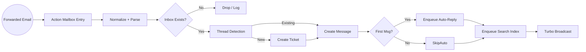
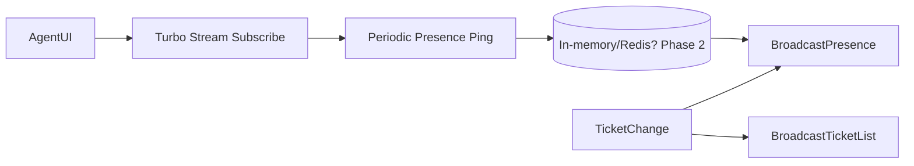
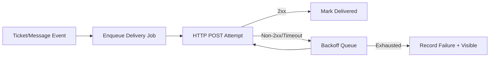

# Design Document (v0.2 – aligned with consolidated requirements)

> This document provides an implementable architecture blueprint derived from `requirements.md` (v0.1). It focuses on: domain design, flows, component boundaries, risk trade‑offs, and sequencing. Code snippets illustrate intent; they are not final.

## 1. Scope & Goals
MVP scope (Phase 1): multi-tenant (subdomain) help desk: inbox email ingestion, tickets (states + priorities + tags), Liquid templates + signatures, search (Meilisearch), real-time updates (presence + ticket list), seat-based Stripe billing (trial + proration), webhook engine, dark-mode UI. Phase 2 & Deferred features are intentionally shaped for low-friction extension (see requirements for list).

Non-goals: analytics dashboards, complex SLA engine, spam scoring, bulk automation rules, CSAT surveys, mobile-first optimization, advanced audit trail, org-level customers, watchers.

## 2. Architectural Overview
Single Rails 8.1 monolith (Sqlite3 primary) with integrated subsystems:
* Data: implemented with the new tenancy gem https://github.com/basecamp/activerecord-tenanted.
* Async: Solid Queue (sqlite-backed) for ingestion, indexing, webhooks, billing seat sync.
* Real-time: Turbo + SolidCable (ActionCable adapter) for presence + live updates.
* Search: Meilisearch (either separate service or managed instance) – one logical index per tenant or shared index + `tenant_id` filter (decision matrix below).
* Caching: Solid Cache + BunnyCDN for static assets.
* Frontend: Server-rendered Turbo views + Stimulus controllers for progressive interactivity (See 28.).
* Observability: Sentry (errors), Skylight (perf). Minimal internal health endpoint.

### 2.1 Tenancy Enforcement Layers
1. Routing constraint extracts subdomain -> loads tenant (404 if missing).
2. Current tenant stored in `Current` attributes (thread-safe via ActiveSupport).
3. Model mixin enforces `default_scope { where(tenant_id: Current.tenant.id) }` (careful: prefer explicit `for_tenant` scope to avoid surprises in background jobs).
4. Policy layer (Pundit) double-checks tenant alignment + role + inbox membership.
5. Caching uses prefix: `tenant:{tenant_id}:...`.

Decision: Avoid Apartment or schema-per-tenant; rely on row‑level scoping for lower operational overhead and simpler query optimization.

## 3. Domain Model (Conceptual)
Core Entities: Tenant(Account), User, Inbox, Recipient, Ticket, Message, Tag, TicketTag, Template, AgentSignature, WebhookEndpoint, WebhookDelivery, Subscription/Billing (Pay gem), Presence (ephemeral), SearchIndexJob.

### 3.1 Key Aggregates
* Ticket aggregate = Ticket + Messages + Tags (write operations update ticket `last_activity_at`).
* Inbox aggregate = Inbox + access memberships.
* Billing aggregate = Account + Users(agent status) + Stripe subscription.

### 3.2 Relationships (simplified)
Tenant 1—* Users
Tenant 1—* Inboxes 1—* Tickets 1—* Messages
Tenant 1—* Recipients (unique by email)
Tenant 1—* Tags (*—* Tickets)
Tenant 1—* Templates
Tenant 1—* WebhookEndpoints 1—* WebhookDeliveries

## 4. Data Flow Diagrams

### 4.1 Email Ingestion Pipeline


### 4.2 Presence & Real-Time

MVP presence can be naive (broadcast join/leave events) without a Redis registry; Phase 2 can add ephemeral store for resilience.

### 4.3 Webhook Delivery


## 5. Component Breakdown
| Component | Responsibility | Notes |
|-----------|----------------|-------|
| Action Mailbox Ingress | Receives forwarded emails | MX handled externally; we expose ingress address |
| EmailProcessor | Orchestrates parse → recipient → ticket/message → auto-reply | Idempotent on message-id |
| ThreadingService | Determine ticket association | Uses VERP + headers fallback |
| TicketUpdater | State & priority changes + side effects | Emits events |
| PresenceChannel | Broadcast viewing agents | Basic list; future typing indicator |
| SearchIndexer | Consolidates indexing operations | Batched fallback rake task |
| WebhookDispatcher | Filters endpoints & dispatches signed payloads | HMAC SHA256 header |
| BillingSeatSync | Adjust Stripe subscription quantity | Debounced within transaction callbacks |
| SuspensionEnforcer | Middleware / before_action gating suspended tenants | Only billing allowed |

## 6. Storage & Indexing Strategy
* RDBMS (Sqlite3) single cluster.
* Suggested composite indexes:
  * `tickets(tenant_id, inbox_id, state, last_activity_at DESC)` for list filters.
  * `messages(ticket_id, created_at)` for chronological thread retrieval.
  * `tags(tenant_id, name)` unique.
  * `ticket_tags(ticket_id, tag_id)` unique.
  * `recipients(tenant_id, email)` unique.
  * `webhook_deliveries(endpoint_id, created_at)`.
* Avoid over-indexing early; measure with pg_stat_statements.

### 6.1 Meilisearch Indexing Options
Option A (Per Tenant Index): simpler tenant filter, higher index count; good if < few thousand tenants early.
Option B (Single Shared Index): add `tenant_id` facet; fewer resources but complex reindex partials.
Decision: Start with Option A to simplify isolation & deletion; monitor growth.

## 7. Email Threading Design
Inbound detection precedence:
1. VERP reply-to token (highest confidence) → decodes ticket id & conversation hash.
2. `In-Reply-To` / `References` header mapping (store message-id → ticket id in a lightweight table or messages table index).
3. Subject heuristic fallback (normalized, only if recent open/pending ticket exists with same canonical subject and same sender email and same inbox; reduce collision risk).

Idempotency: Use RFC `Message-ID`; if duplicate, discard (log) or append as duplicate attempt metric.

## 8. Ticket Lifecycle & Events
State transitions allowed:
Open → Pending / On-hold / Resolved / Closed
Pending ↔ Open / On-hold / Resolved / Closed
On-hold ↔ Open / Pending / Resolved / Closed
Resolved → Closed / Reopen(Open)
Closed → Reopen(Open)

Event names (internal): `ticket.state.changed`, `ticket.priority.changed`, `ticket.assignee.changed`, `message.created.public`. These feed both broadcasts + webhook queue.

## 9. Tagging UX & Data
Autocomplete query: `SELECT name FROM tags WHERE tenant_id=? AND name ILIKE 'prefix%' LIMIT 10` (index supports). Debounce keystrokes in Stimulus controller.

## 10. Templates & Liquid Rendering
Rendering pipeline:
1. Fetch template body (rich text optional? MVP plain or Action Text?).
2. Build context: `recipient.first_name`, `last_message` (strip HTML, truncate 200 chars), `agent.signature` (rich allowed – sanitize before sending email if needed).
3. Use Liquid::Template.parse (cache compiled AST per template `updated_at` digest). Danger: ensure no file system or unsafe tags (whitelist standard tags only).

## 11. Security & Authorization
* All controller actions require authenticated user except signup/invitation acceptance.
* Pundit policies validated in controllers; skip only for public status pages (none MVP).
* Cross-tenant leakage tests: add RSpec shared examples forging another tenant's id.
* Admin-only raw email access limited to MotorAdmin behind HTTP Basic + internal IP allowlist (optional Phase 2).
* HMAC for webhooks: `X-Whisperdesk-Signature: sha256=hex(hmac(secret, body))`.
* Rate limiting (Deferred). Basic rack-attack scaffold optional Phase 2.

## 12. Billing & Seat Logic
Seat count = number of `users` with `is_agent=true`. When toggled:
1. Transaction updates user.
2. Enqueue seat sync job (debounce: collapse multiple changes in short window using cache lock).
3. Seat sync calls Pay to update subscription quantity.
Suspension check: before_action `ensure_active_subscription` except BillingController.

## 13. Background Jobs
Queue taxonomy (Solid Queue labels):
* `ingest` – email processing
* `webhooks` – outbound deliveries
* `search` – indexing
* `billing` – seat sync / suspension tasks
* `default` – everything else
Retry policy: Accept Solid Queue defaults; for webhooks use exponential (custom wrapper: attempts at ~0s, 30s, 2m, 10m, 30m, 2h).
Dead letters: Mark as failed; surface in WebhookEndpoint detail page.

## 14. Real-Time Implementation Details
Ticket list partial renders each ticket row with DOM ID `ticket_{id}`; updates broadcast as Turbo `replace` operations. Presence: channel name `tenant:{id}:ticket:{id}:presence` broadcasting array of user display names. MVP presence store in-memory per Puma worker; risk: stale if multi-process → Accept (Phase 2: Redis ephemeral store with TTL heartbeats).

## 15. Caching Strategy
What to cache:
* Ticket list queries (key: tenant + filter hash) – small TTL (e.g., 10s) since live updates also push changes; or rely only on DB + indexes early (keep simple initially, add cache after measuring).
* Compiled Liquid templates (key by template id + updated_at digest) unlimited TTL.
* Presence ephemeral – not cached (broadcast only).
Avoid caching per-ticket message threads initially (frequent writes). Defer Russian doll complexity until profiling shows need.

## 16. Observability & Instrumentation
Custom ActiveSupport::Notifications:
* `email.ingest.started / .completed`
* `webhook.delivery.attempt`
* `search.index.enqueue`
Wrap Stripe seat sync with timing metric. Provide Skylight custom probes if needed.

## 17. Error Handling & Resilience
Errors categories:
* Ingestion parse failure → retry limited (3) else log & notify admin.
* Duplicate Message-ID → info log, no raise.
* Webhook 410 Gone (endpoint removed) → deactivate endpoint automatically.
* Stripe webhook signature mismatch → 400 + alert.

## 18. Performance Considerations
Targets (non-binding):
* Ticket list (<50 tickets page) server render < 300ms P95.
* Email ingestion median < 1s from receive to broadcast.
Approach: Avoid N+1 (eager load inbox, assignee, tags). Background indexing decoupled from request path.

## 19. Testing Strategy (TDD Alignment)
Layers:
1. Model specs: validations, scopes, state transitions, Liquid rendering context.
2. Policy specs: each role path + negative tests.
3. Service specs: EmailProcessor (idempotency, new vs existing ticket), ThreadingService heuristics.
4. Job specs: ensure idempotency & retry semantics (simulate duplicate message-id).
5. System specs: onboarding flow, ticket creation, presence broadcast (assert stream fragment), billing seat toggle.
6. Search specs: index integration (use Meilisearch test container or stub adapter with contract tests).
Factories: Ensure each factory sets tenant and relational integrity.

Example contract for webhooks (pseudo):
```ruby
RSpec.shared_examples "signed webhook" do
  it "includes correct signature" do
    payload = { event: 'ticket.created', data: { id: ticket.id } }.to_json
    sig = described_class.signature(secret, payload)
    expect(sig).to match(/^sha256=/)
  end
end
```

## 20. Migration Strategy (Early Stage)
Edit existing migrations until first production deploy. When editing: ensure schema load remains deterministic (`db:reset` in CI). After freeze milestone, introduce additive migrations only.

## 21. Extension Points (Phase 2+)
* SMTP per tenant: Add `smtp_settings` JSON column to Inbox or Tenant; adapter pattern for Mailer.
* Typing indicators: dedicated channel events (`typing:start`, `typing:stop`) throttled client-side.
* Imports: Staged table `import_rows` with status + error column; reconciler service.
* Bounce tracking: Add `message_delivery_attempts` table referencing outbound messages.

## 22. Risk & Mitigation Matrix
| Risk | Impact | Likelihood | Mitigation |
|------|--------|------------|-----------|
| In-memory presence loss (multi-process) | Incorrect presence UI | Medium | Accept MVP; add Redis Phase 2 |
| Meilisearch outage | Search unusable | Medium | Clear user message; Phase 2 fallback |
| Seat desync with Stripe | Incorrect billing | Low | Nightly reconciliation job Phase 2 |
| Tenant data leak via missing scope | Severe | Low | Pundit + model scope tests + code review checklist |
| Email threading collision | Mild (wrong association) | Medium | Prefer VERP + headers; log subject heuristic decisions |
| Liquid template injection (HTML) | XSS risk | Medium | Sanitize output for emails & UI render |

## 23. Decision Log (ADR Summary)
1. Single DB row-based tenancy over schema-per-tenant – faster dev, simpler ops.
2. Per-tenant Meilisearch index initial – easier purge & isolation.
3. Presence ephemeral in-memory MVP – speed over perfect accuracy.
4. Liquid for templates – widely used & safe with filtered context.
5. Pay gem (Stripe) seat pricing – leverage existing abstraction.

## 24. Implementation Sequencing (Suggested Sprints)
Sprint 1: Tenancy scaffold, User auth (Devise + Google), basic navigation, Account signup + subdomain.
Sprint 2: Inboxes + email ingestion pipeline (Action Mailbox), Recipient model, Ticket creation + states.
Sprint 3: Messages (public + internal), real-time ticket list updates + presence MVP.
Sprint 4: Tagging + Search indexing (tickets/messages) + global search overlay.
Sprint 5: Templates + Liquid + signatures, Stripe billing integration (trial + seat updates).
Sprint 6: Webhook engine (events + delivery + retries) + dark mode polish + caching passes.
Hardening: Security review, load smoke (ingestion + indexing), test coverage gaps, docs.

## 25. Open Items Aligning with Requirements 'Open Questions'
* Bounce handling provider: evaluate SES vs Postmark vs SendGrid features for webhook enrichments.
* Virus scanning: Evaluate ClamAV sidecar vs API (e.g., Cloudmersive) – cost vs latency.
* SAML storage: likely JSON metadata column + separate `saml_idp_entity_id` index.
* Import CSV mapping: gather sample dumps early to validate minimal viable mapper.

## 26. Sample Code Snippets (Illustrative)
### 26.1 Tenant Context
```ruby
class SetCurrentTenant
  def initialize(app) = @app = app
  def call(env)
    request = ActionDispatch::Request.new(env)
    sub = request.subdomains.first
    Current.tenant = Tenant.find_by!(subdomain: sub)
    @app.call(env)
  ensure
    Current.reset
  end
end
```

### 26.2 Event Emission Pattern
```ruby
module EmitsEvents
  def emit(event, payload)
    ActiveSupport::Notifications.instrument(event, payload)
    WebhookEnqueueJob.perform_later(event, payload[:id]) if WebhookEvents.supported?(event)
  end
end
```

### 26.3 Secure Webhook Signature
```ruby
class WebhookSigner
  def self.signature(secret, body)
    digest = OpenSSL::HMAC.hexdigest('SHA256', secret, body)
    "sha256=#{digest}"
  end
end
```

## 27. Quality Gates Checklist (CI)
1. Lint (Rubocop once added) + brakeman later.
2. RSpec (model + service + system) must pass; coverage threshold gradually enforced.
3. Meilisearch integration test (skipped if env var DISABLE_SEARCH_TESTS=1 for quick runs).
4. Security tests: cross-tenant access attempt spec.
5. DB schema load & `db:reset` no errors.

## 28. View / UI Architecture
- Frameworks: Turbo + Stimulus, Tailwind-rails, view_components (and view_components_contrib).
- ShadCN for rails, but it's alternative called BasecoatUI. (https://basecoatui.com/installation). Look at https://basecoatui.com/kitchen-sink/ for components available.
- Components should be rendered using view_components to encapsulate logic and styling, promoting reusability and maintainability across the application.
- Don't use any global styles with Tailwind's @apply, unless absolutely necessary.
- Everything must be dark mode compatible.
- Everything must be mobile responsive.
- Use partials and russian doll patterns to break down complex views into manageable components, when caching is possible (use Rails's shorthand with collection rendering, rather than nesting, if default rendering applies).

## Summary
This design operationalizes the requirements with explicit component boundaries, sequencing, and safeguards for tenancy, billing, and email threading. Next refinement layers: finalize index strategy script, create initial migrations (editable), scaffold factories, and start Sprint 1.

---
Propose edits via diff; keep this doc authoritative for engineering decisions. ADRs should be appended as decisions evolve.
